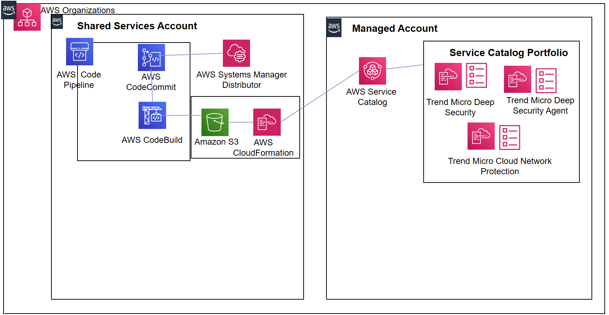

# DevOps Automation for a multi AWS account Trend Micro solution using AWS Service Catalog, AWS CodePipeline and AWS Systems Manager Distributor

 These templates demonstrate the combined use of DevOps automation and Infrastructure as Code (IaC) via AWS CodePipeline, AWS Service Catalog and AWS CloudFormation to enable CCOE (Cloud Center of Excellence) AWS administrators and infrastructure engineers to automate the management and deployment of these Trend Micro AMI based products (Deep Security and Cloud Network Protection) available in the AWS Marketplace across multiple accounts and regions.

 The solution also demonstrates leveraging the newly released AWS Systems Manager Distributor feature of packaging third party agents. The solution uses this feature to implement a mechanism that allows automation via AWS Service Catalog for the provisioning of the Trend Micro Deep Security agent in managed accounts in the AWS Organization.

 We will deploy this solution in a multi account AWS Organization.  Our AWS Organization comprises of a Shared Services account which is where CCOE (Cloud Center of Excellence) administrators can deploy shared services such as our AWS CodePipeline based devops service as well as other services such logging, networking, monitoring etc.  From a hub and spoke perspective, our Shared Services account is the Hub account and the managed accounts are spoke accounts where Trend Micro products/agents get deployed.

## Personas

1.	CCOE (Cloud Center of Excellence) AWS Administrator
1. Performs initial setup. This is performed from the AWS Shared Services account. On completion of the initial set up, the DevOps infrastructure (AWS CodePipeline) is provisioned in the AWS Shared Services account and a Trend Micro Service Catalog Portfolio is provisioned in the managed accounts. 
	1. The Trend Micro Service Catalog contains a portfolio of AWS Service Catalog products specifically Trend Micro Deep Security, Trend Micro Cloud Network Protection and the Trend Micro Deep Security Agent. 
	2. Performs code updates. This is performed from the local Git repository. The Administrator checks in updated Trend Micro product templates and (optionally) an updated buildspec.yaml. The updated code flows via the AWS CodePipeline in the AWS Shared Services Account and updates the Service Catalog Portfolio in the managed accounts.

2.	End User/ AWS Administrator in the Managed (Spoke) accounts.
	1. The end user launches Trend Micro products (including the TrendMicro Deep Security agent) from the Service Catalog Console in the managed account. 

## What is implemented

The following AWS CloudFormation templates have been implemented for this solution -
1.	aws-trendmicro-codepipeline.yaml: This sets up the AWS CodePipeline automation for the Trend Micro products in the Shared Services (Hub) account
2.	aws-trendmicro-servicecatalog-portfolio.yaml: This sets up the Service Catalog Portfolio for the Trend Micro AMIs and the Systems Manager Distributor based Trend Micro Agent products in the managed (spoke) accounts
3.	aws-systemsmanagerdistributor-agent:  This template installs the Trend Micro Deep Security Agent as an AWS Systems Manager Distributor package in the managed accounts.  It uses the AWS-ConfigureAWSPackage AWS Systems Manager Association and leverages the supplied ‘TrendMicro-CloudOne-WorkloadSecurity’ package via the integration between AWS Systems Manager Distributor and Trend Micro Workload Security. It also provisions a AWS Systems Manager Parameter Store with the parameters as required by this integration. Please enter the values of dsTenantId and dsToken by logging in to the Trend Micro Workload Security console from Support > Deployment Scripts as documented here 
4. buildspec.yml - The solution also provides the buildspec.yml that would be placed into the GitHub repository

## Architecture

## Pre-requisites

1. Trend Micro AMI product templates - The Trend Micro AMI based products are available from the AWS Marketplace.  The use of all Trend Micro templates requires appropriate licensing as noted in the AWS Marketplace. For this solution, we will use the following Trend Micro source templates: 
	1. The Trend Micro Deep Security AWS CloudFormation template is available from the Trend Micro Deep Security on AWS Quickstart.
	2. This solution also includes a sample Trend Micro Cloud Network Protection template - tippingpoint-cloudnetworksecurity.yaml. The template requires an AMI ID as an input. Please obtain this AMI ID from the AWS Marketplace once you subscribe to the product and accept the licensing terms there.
2. Local Git repository and AWS CodeCommit Git Repository - Create an AWS CodeCommit Git Repository in the AWS Shared Services Account and integrate with your local Git repository as documented in the AWS documentation. The Repository should contain the following templates – 
	1. TrendMicro AMI templates: Trend Micro Deep Security and Trend Micro Cloud Network Protection.
	2. AWS CloudFormation templates provided in this solution –AWS Service Catalog Portfolio template and the AWS Systems Manager Distributor template for the Trend Micro Deep Security Agent
	3. Buildspec.yml provided in this solution

The pre-requisite steps would be performed by the CCOE (Cloud Center of Excellence) AWS Administrator in the AWS Shared Services Account
 

## How to Install and Test

The initial set up is done by the CCOE (Cloud Center of Excellence) AWS Administrator from the Shared Services Account. The AWS Shared Services Account Administrator simply performs the following step -
1. Launch the aws-trendmicro-codepipeline.yaml template in the Shared Services account and in the region where the CodeCommit Git repository was previously set up. 

This 1 step executes the following -
1. Provisions an AWS CodePipeline in the AWS Shared Services account
2.	The AWS CodeCommit stage of the AWS CodePipeline downloads the code from the AWS CodeCommit Git Repository and into the Amazon S3 Artifact repository of the AWS CodePipeline
3. The AWS CodeBuild stage of the AWS CodePipeline uses the AWS Service Catalog Portfolio template, executes the commands in the buildspec.yaml and leverages AWS CloudFormation stacksets to launch the aws-trendmicro-servicecatalog-portfolio in the managed accounts. 
	1.	This creates the Service Catalog Portfolio in the managed accounts with the Trend Micro AMI products and the Trend Micro Systems Manager Distributor agent product. 
	2.	This also creates an end user, end user group, end user role and a launch constraint in the managed accounts.  This basically allows the end user in managed accounts to login and directly use the Service Catalog interface to launch Trend Micro products. 

In order to test that the initial setup was successful, login to the Managed Account as an end	user and perform the following step–

1.	Log in to the managed account as an end user.
2.	Navigate to the Service Catalog console in the AWS managed account and click on Products in the left panel of the console.  Select a product and launch Trend Micro products and the Trend Micro Deep Security agent directly from here. As a best practice, the AWS Service Catalog product for the Trend Micro agent is set up to allow deployment of Trend Micro Deep Security agents to EC2 instances based on resource tags.
3.	Accept the defaults to test the launch of the Trend Micro Deep Security agent.
4.	Follow the instructions in the Deep Security Quick Start to set up Trend Micro Deep Security.

Updates are performed directly from the local GitHub repository. The CCOE AWS Administrator checks in updated TrendMicro source template(s) in this step. If this is the first time that this update is being performed, then the check-in should also include a modified buildspec.yml file. Replace the existing buildspec.yaml with the buildspec-updates.yml file and rename the buildspec-updates.yml to buildspec.yml. The modified buildspec.yaml file invokes update-stackset on CloudFormation instead of a create-stackset. 

AWS CodePipeline will automatically recognize the commit and proceed through its stages and actions and update the Trend Micro products in AWS Service Catalog of the managed accounts. The automated pipeline for managing AWS Service Catalog is now set up and responding to template changes via git commits.

For our walkthrough, let’s test performing updates as a CCOE administrator.

1.	In your local git repository and inside the distributor agent folder, rename the aws-systemsmanagerdistributor-agent-v1.yaml file to aws-systemsmanagerdistributor-agent-v2.yaml. Assume that you have a new version of the agent and a new version of this template has been created for that and checked in your source code repository.
2.	In your local git repository, update the aws-trendmicro-servicecatalog-portfolio AWS CloudFormation template. Look for the Resources section in this template and specifically the TrendMicroDeepSecurityAgent Resource. Update the ProvisioningArtifactParameters section with the following: 
	Description: This is version 2.0 of Trend Micro Deep Security Agent
	Name: Version - 2.0
	Info: LoadTemplateFromURL: !Sub "${S3StagingBucketURL}distributoragent/aws-systemsmanagerdistributor-agent_v2.yaml"
3.	Replace the existing buildspec.yml file with buildspec-updates.yml. Rename buildspec-updates.yml to buildspec.yml.
4.	In your git bash terminal on your local machine, issue the following commands to update the AWS CodeCommit Repository with changes from your local git repository
	git add .
	git commit –m “version update”
	git push origin master
5.	Sign in to the AWS Shared Services account and open the AWS CodePipeline console. You should see that the code pipeline gets triggered due to a new commit in the AWS CodeCommit repository.
6.	Verify that all stages of the AWS CodePipeline complete successfully.
7.	Open the AWS CloudFormation console and choose StackSets and then Operations.
8.	Verify that the aws-trendmicro-servicecatalog-portfolio StackSet is updated successfully
9.	Sign in to the AWS managed account as an end user and open the AWS Service Catalog console.
10.	Verify that the Trend Micro Deep Security Agent product has been updated with the new version, template, and description.

## Author

Kanishk Mahajan; kmmahaj@amazon.com